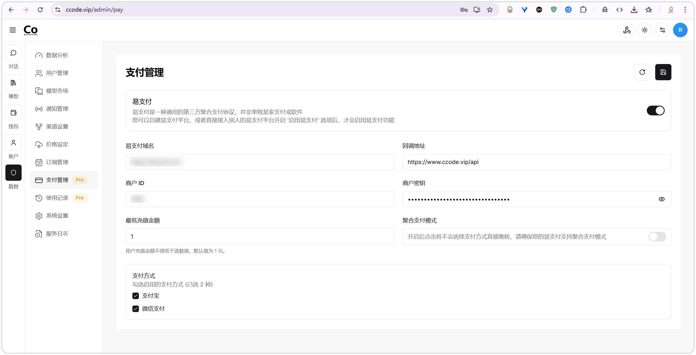
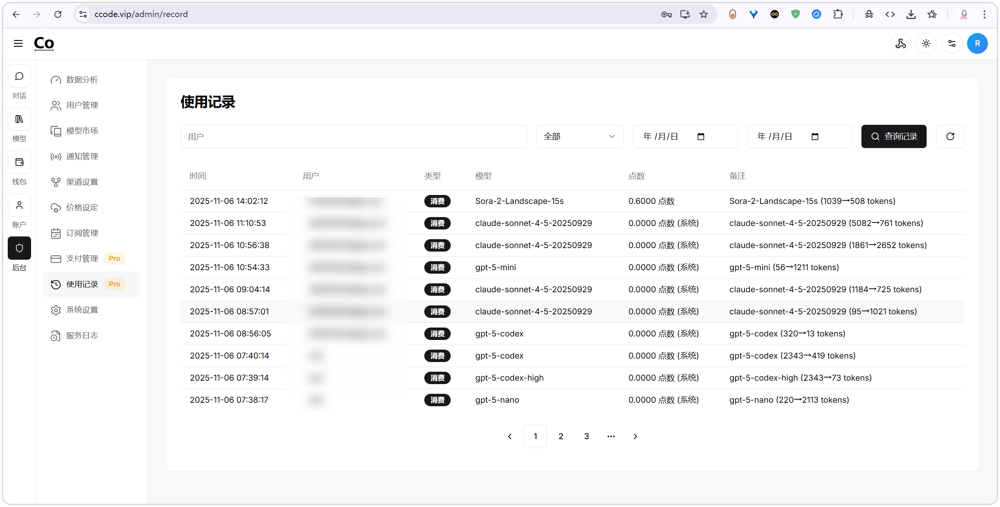
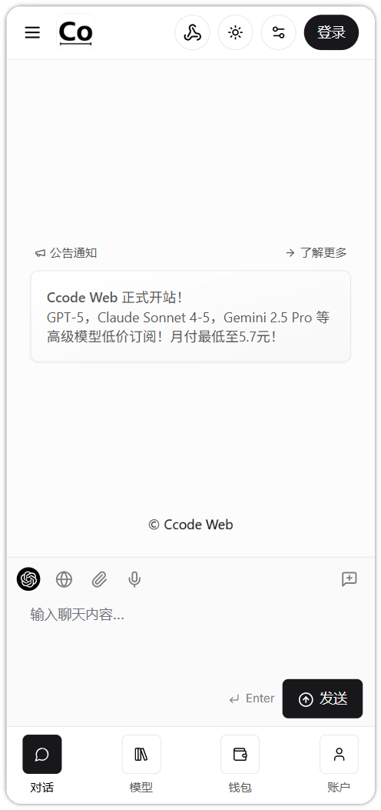

# CoAI 定制二开


## 项目介绍

CoAI 定制版是基于开源 AI 平台 Coai 的定制分支，提供了增强的功能和更好的用户体验。**请注意：此版本与 Coai 官方团队没有任何关联，亦非由其维护。**

本项目致力于提供一个功能全面、稳定可靠的 AI 对话平台，适用于个人和企业用户。

## 主要特性

- 🌟 **多模型支持**：集成多种主流 AI 模型，包括 GPT、Claude、文心一言等
- 📊 **使用日志系统**：详细记录用户交互数据，便于分析和优化
- 💳 **支付系统**：内置完整的支付和订阅管理功能
- 🖼️ **图像识别增强**：修复了较新模型无法使用图像识别的问题
- 🎬 **视频处理优化**：修复了图像以及视频逆向模型输出格式不正常的问题
- 🎨 **界面优化**：取消了工具栏的隐藏功能，提升用户体验
- 📱 **响应式设计**：适配各种设备和屏幕尺寸

## 与原版的主要区别

1. **新增功能**：
   - 使用日志系统：记录所有用户交互，便于数据分析和问题排查
   - 支付系统：集成多种支付方式，支持订阅和按量付费模式

2. **问题修复**：
   - 修复了较新模型无法使用图像识别的问题
   - 修复了图像以及视频逆向模型输出格式不正常的问题
   - 取消了工具栏的隐藏功能（个人认为这是负面功能容易让人找不到）

3. **部署优化**：
   - 提供了简化的部署流程
   - 优化了配置文件结构


## 演示与推荐

- **API中转服务**：`https://api.ccode.vip/` 是本人自建API中转服务，欢迎使用，与本项目无任何关联
- **自营站点**：`https://www.ccode.vip/` 注册赠送一点积分供演示使用

## 演示图片




## 快速部署
下载最新已编译的发行版压缩包 Quickdeployment.7z
解压并配置config.yaml（数据库与Redis也需自行解决）
启动目录下的chatnio（Linux环境）或chatnio.exe（Windows环境）

## 编译部署

### 环境要求

- Go 1.21 或更高版本
- MySQL 5.7 或更高版本
- Redis 5.0 或更高版本
- Node.js 18 或更高版本（用于前端开发）

### 安装步骤

1. 克隆项目：
```bash
git clone [项目仓库地址]
cd coai
```

2. 安装依赖：
```bash
go mod vendor
```

3. 配置数据库：
- 创建MySQL数据库（无需任何数据，后台会自动初始化）
- 配置Redis连接

4. 修改配置文件：
```bash
cp config.example.yaml config.yaml
# 编辑config.yaml，至少需要填入MySQL,Redis和server
```

5. 直接构建后端：
```bash
go build -mod=vendor -v -o chatnio
```

6. 启动服务：
```bash
./chatnio
```

## 部署说明

### Windows下编译为Linux Debian AMD64

使用以下命令在Windows环境下编译适用于Linux Debian AMD64的可执行文件：

```bash
docker run --rm -v "${PWD}:/src" -w /src golang:1.21-bullseye bash -lc "apt-get update && apt-get install -y build-essential libwebp-dev && CGO_ENABLED=1 GOOS=linux GOARCH=amd64 /usr/local/go/bin/go build -mod=vendor -v -o chatnio"
```

或使用阿里云镜像加速下载：

```bash
docker run --rm -v "${PWD}:/src" -w /src golang:1.21-bullseye bash -lc "sed -i 's|deb.debian.org|mirrors.aliyun.com|g' /etc/apt/sources.list && apt-get update && apt-get install -y build-essential libwebp-dev && CGO_ENABLED=1 GOOS=linux GOARCH=amd64 /usr/local/go/bin/go build -mod=vendor -v -o chatnio"
```

### Nginx配置示例

```nginx
server {
    listen 80;
    server_name your-domain.com;

    location / {
        proxy_pass http://localhost:8094;
        proxy_set_header Host $host;
        proxy_set_header X-Real-IP $remote_addr;
        proxy_set_header X-Forwarded-For $proxy_add_x_forwarded_for;
        proxy_set_header X-Forwarded-Proto $scheme;
    }
}
```

## TODO

- [ ] 适配NanoBanana模型

## 文档

- 官方文档：https://www.chatnio.com/docs

## 版权

本项目基于Apache-2.0许可证开源。详情请参阅[LICENSE](LICENSE)文件。

原项目CoAI也采用Apache-2.0许可证。

---

**免责声明**：本项目仅用于学习和研究目的，请遵守相关法律法规，不得用于非法用途。使用本项目所产生的任何后果由使用者自行承担。
