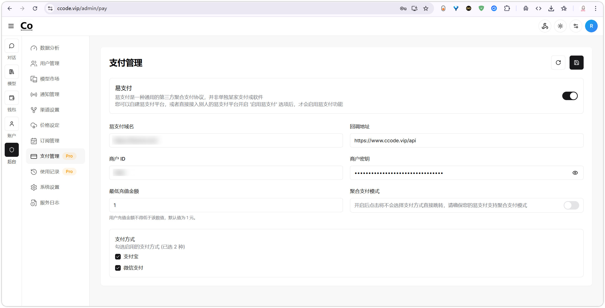
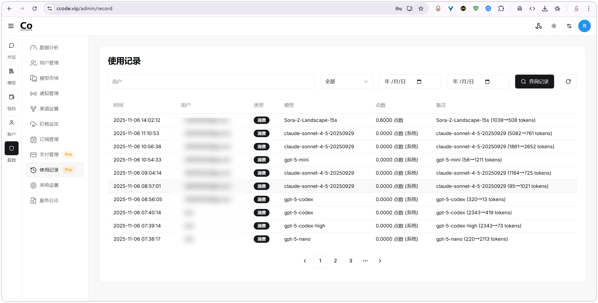
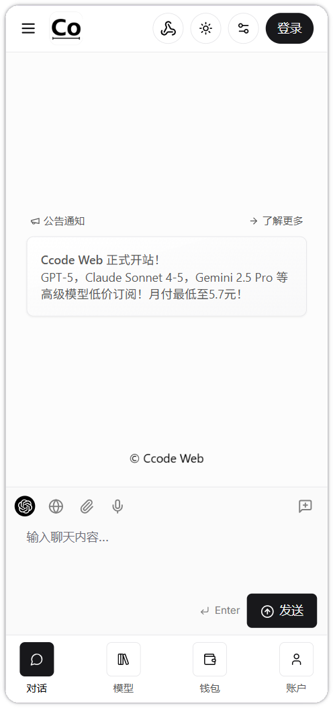

# CoAI 定制二开


## 项目介绍

CoAI 定制版是基于开源 AI 平台 Coai 的定制分支，提供了增强的功能和更好的用户体验。**请注意：此版本与 Coai 官方团队没有任何关联，亦非由其维护。**

本项目致力于提供一个功能全面、稳定可靠的 AI 对话平台，适用于个人和企业用户。

## 主要特性

- 🌟 **多模型支持**：集成多种主流 AI 模型，包括 GPT、Claude、文心一言等
- 📊 **使用日志系统**：详细记录用户交互数据，便于分析和优化
- 💳 **支付系统**：内置完整的支付和订阅管理功能
- ⚡ **异步会话与流式输出**：引入基于 `session_id` 的异步会话机制，前端可通过会话进度流实时订阅输出
- 🔄 **刷新恢复与不中断体验**：刷新页面后可自动打开上次对话并恢复未完成会话的输出（继续显示实时进度）
- 💾 **对话结果持久化**：会话完成后将模型最终回复写入对话历史，刷新后仍可完整加载
- 🖼️ **图像识别增强**：修复了较新模型无法使用图像识别的问题
- 🎬 **视频处理优化**：修复了图像以及视频逆向模型输出格式不正常的问题
- 🎨 **界面优化**：取消了工具栏的隐藏功能，提升用户体验
- 📱 **响应式设计**：适配各种设备和屏幕尺寸

## 与原版的主要区别

1. **新增功能**：
   - 使用日志系统：记录所有用户交互，便于数据分析和问题排查
   - 支付系统：集成多种支付方式，支持订阅和按量付费模式
   - 异步会话与流式输出：后端返回 `session_id` 后，前端通过会话进度流订阅实时输出
   - 刷新恢复：刷新后自动打开上次对话，并可恢复未完成会话（不中断继续显示流式输出）
   - 完成落库：会话完成后将最终模型回复写入对话历史，避免刷新后只剩用户消息

2. **问题修复**：
   - 修复了较新模型无法使用图像识别的问题
   - 修复了图像以及视频逆向模型输出格式不正常的问题
   - 取消了工具栏的隐藏功能（个人认为这是负面功能容易让人找不到）

3. **部署优化**：
   - 提供了简化的部署流程
   - 优化了配置文件结构


## 演示与推荐

- **API中转服务**：`https://api.ccode.vip/` 是本人自建API中转服务，欢迎使用，与本项目无任何关联
- **自营站点**：`https://www.ccode.vip/` 注册赠送一点积分供演示使用

## 演示图片




## 快速部署
下载最新已编译的发行版压缩包 Quickdeployment.7z
解压并配置config.yaml（数据库与Redis也需自行解决）
启动目录下的chatnio（Linux环境）或chatnio.exe（Windows环境）

## 编译部署

### 环境要求

- Go 1.21 或更高版本
- MySQL 5.7 或更高版本
- Redis 5.0 或更高版本
- Node.js 18 或更高版本（用于前端开发）

### 安装步骤

1. 克隆项目：
```bash
git clone https://github.com/tianjiangqiji/coai.git
cd coai
```

2. 安装依赖：
```bash
go mod vendor
```

3. 配置数据库：
- 创建MySQL数据库（无需任何数据，后台会自动初始化）
- 配置Redis连接

4. 修改配置文件：
```bash
cp config.example.yaml config.yaml
# 编辑config.yaml，至少需要填入MySQL,Redis和server
```

5. 直接构建后端：
```bash
go build -mod=vendor -v -o chatnio
```
开发调试：'go run main.go'
或(Windows可执行文件)
```bash
go build -mod=vendor -v -o chatnio.exe
```
6. 启动服务：
```bash
./chatnio
```

### 前端构建（位于 `app/` 目录）

后端默认从 `./app/dist` 目录加载静态前端文件，因此在生产环境中需要先构建前端，将构建产物放到 `app/dist`，然后再启动后端服务。

环境要求：
- Node.js 18 或更高（项目使用 TypeScript 和 Vite）
- 推荐使用 pnpm（速度更快），也可以使用 npm 或 yarn

#### 开发环境配置

若需要使用 `npm run dev` 进行前端热更新开发，请注意以下配置：

1. **API 转发配置**：修改 `app/src/conf/bootstrap.ts` 文件。
   - 将 `export const deploy: boolean = true;` 修改为 `false`。
   - 这样前端将请求 `http://localhost:8094`（默认后端端口）而非本地 `/api` 路径。
   - 同时，Token 存储字段会切换为 `token-dev`，避免与生产环境冲突。
2. **Vite 代理**：确保 `app/vite.config.ts` 中的 `server.proxy` 配置正确指向后端地址。

常用命令（在仓库根目录或直接进入 `app/` 目录）：

开发（热重载）:
```bash
cd app
pnpm install
pnpm run dev
```

预览/构建（生产）：
```bash
cd app
pnpm install          # 第一次需要安装依赖
pnpm build            # 等同于 npm run build
# 构建成功后会在 app/dist 目录生成静态文件，后端会直接读取该目录并对外提供服务
```

提示与注意事项：
- 构建命令使用了 TypeScript 编译（tsc）和 Vite，可能会占用较多内存。README 中的构建脚本已设置 NODE_OPTIONS=--max_old_space_size=4096 来允许 4GB 内存，如遇到构建失败可尝试增加该值或使用 `fast-build` 简化构建命令：
   - `pnpm run fast-build`（或 `npm run fast-build`）
- 若希望将前端单独部署到 CDN/静态服务器，请将 `app/dist` 的内容上传至静态托管，然后在 `config.yaml` 中调整后端或前端的 API 地址，使二者能正常通信。


## 部署说明

### Windows下编译为Linux Debian AMD64

使用以下命令在Windows环境下编译适用于Linux Debian AMD64的可执行文件：

```bash
docker run --rm -v "${PWD}:/src" -w /src golang:1.21-bullseye bash -lc "apt-get update && apt-get install -y build-essential libwebp-dev && CGO_ENABLED=1 GOOS=linux GOARCH=amd64 /usr/local/go/bin/go build -mod=vendor -v -o chatnio"
```

或使用阿里云镜像加速下载：

```bash
docker run --rm -v "${PWD}:/src" -w /src golang:1.21-bullseye bash -lc "sed -i 's|deb.debian.org|mirrors.aliyun.com|g' /etc/apt/sources.list && apt-get update && apt-get install -y build-essential libwebp-dev && CGO_ENABLED=1 GOOS=linux GOARCH=amd64 /usr/local/go/bin/go build -mod=vendor -v -o chatnio"
```

### Nginx配置示例

```nginx
server {
    listen 80;
    server_name your-domain.com;

    location / {
        proxy_pass http://localhost:8094;
        proxy_set_header Host $host;
        proxy_set_header X-Real-IP $remote_addr;
        proxy_set_header X-Forwarded-For $proxy_add_x_forwarded_for;
        proxy_set_header X-Forwarded-Proto $scheme;
    }
}
```

## TODO

- [x] 对话页，绘画页支持异步调度（关闭浏览器再进入网页仍然可找回未完成的会话，服务器与AI API端进行后台调度）
- [x] 绘画页图片查看器，历史记录浏览器端存储
- [ ] 绘画页-适配 NanoBanana,sora,veo,gpt-image
- [ ] 对话页-适配 NanoBanana 模型

## 文档

- 官方文档：https://www.chatnio.com/docs

## 版权

本项目基于Apache-2.0许可证开源。详情请参阅[LICENSE](LICENSE)文件。

原项目CoAI也采用Apache-2.0许可证。

---

**免责声明**：本项目仅用于学习和研究目的，请遵守相关法律法规，不得用于非法用途。使用本项目所产生的任何后果由使用者自行承担。
